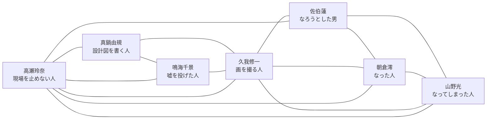

# 相関図

## 目的

撮影開始時点の関係、物語進行で変化する関係、あとから効くかもしれない裏接点を分けて管理する。

使わない設定も、価値観、言葉遣い、距離感、場面の説得力の裏取りになる可能性があるため保存する。

## レイヤー

### 1. 撮影開始時点の関係

現場に入った時点で、本人たちが認識している関係。

| A | B | 関係 | 温度 | 備考 |
| --- | --- | --- | --- | --- |
| 佐伯蓮 | 朝倉澪 | 共演者 | 未定 | 作中映画では元恋人同士を演じる。本人同士の距離は未定。 |
| 佐伯蓮 | 山野光 | 共演者 | 未定 | 片方は引退前の俳優、片方は急に抜擢された元エキストラ。緊張が生まれやすい。 |
| 朝倉澪 | 山野光 | 共演者 | 未定 | 朝倉が山野のカメラ映りをどう見るかが重要。 |
| 久我修一 | 佐伯蓮 | 監督と俳優 | 未定 | 久我が佐伯をどう評価しているか未定。 |
| 久我修一 | 朝倉澪 | 監督と俳優 | 未定 | 朝倉の芝居に映画を預ける可能性がある。 |
| 久我修一 | 山野光 | 監督と抜擢対象 | 予定外の違和感 | 画で最初に止まるのは久我。実務確認を走らせるのは高瀬。 |
| 真鍋由規 | 鳴海千景 | 原作と脚色 | 摩擦と妙な相性 | 鳴海の破綻を、真鍋が現場で撮れる設計図へ落とす。 |
| 久我修一 | 真鍋由規 | 制作パートナー | 軽口と職能信頼 | 腕は信頼している。人格や過去は信用しきっていない。 |
| 久我修一 | 鳴海千景 | 映像化する側と原作側 | 面白がりと警戒 | 原作の無責任さを、久我が画の余白として受け止める。 |
| 高瀬玲奈 | 久我修一 | ADと監督 | 実務的な信頼と苛立ち | 久我の小さい返事を危険信号として読む。 |
| 高瀬玲奈 | 真鍋由規 | 実務と脚本 | 文句込みの信頼 | 高瀬が無茶を持ち込み、真鍋が嫌がりながら三行にする。 |
| 高瀬玲奈 | 鳴海千景 | 現場実務と原作者 | 丁寧な距離 | 鳴海の「面白い」を、高瀬が発注、確認、保留へ変換する。 |
| 高瀬玲奈 | 全員 | 現場調整 | 実務的 | 若者チームと制作側の間をつなぐ。 |

### 2. 物語進行で変わる関係

撮影が進むことで、距離、評価、依存、対立が変わる関係。

| A | B | 初期 | 変化候補 | 終盤候補 |
| --- | --- | --- | --- | --- |
| 佐伯蓮 | 朝倉澪 | 共演者 | 佐伯の引退意識を朝倉が見抜く | 互いに役者として区切りをつけるきっかけになる |
| 佐伯蓮 | 山野光 | 予定された俳優と予定外の抜擢者 | 佐伯が山野に嫉妬する | 山野の存在で佐伯が最後に本気を出す |
| 朝倉澪 | 山野光 | プロと素人寄りの抜擢者 | 朝倉が山野の無自覚な強さに揺れる | 朝倉が「なった人」として山野に何かを渡す |
| 久我修一 | 山野光 | 予定外の発見 | 映画の意味が山野に引っ張られる | 久我が自分だけの映画ではないと認める |
| 真鍋由規 | 役者陣 | 書く側と演じる側 | 台詞が役者本人の人生に刺さり始める | 脚本が設計図の外へ出た責任を引き受ける |
| 鳴海千景 | 役者陣 | 外側から笑う側と演じる側 | 原作者の嘘が役者の本気で立ち上がる | 原作者が自分の物語が他人へ渡ったことを受け入れる |
| 高瀬玲奈 | 佐伯蓮 | 現場スタッフと俳優 | 裏接点が判明する可能性 | 高瀬が佐伯の撤退に別の光を当てる |

### 3. 裏接点・使うか未定の関係

今すぐ本文に出さなくてもよい。あとで価値観や距離感の裏取りとして使える候補。

| 接点 | 関係者 | 内容 | 使える効果 | 採用状態 |
| --- | --- | --- | --- | --- |
| 同郷 | 佐伯蓮、高瀬玲奈 | 出身地が同じ。学校も同じ。高瀬が3学年上の先輩。 | 言葉遣い、価値観、地元ネタ、距離の近さの裏取り。 | 採用 |
| 学校の時計伝説 | 高瀬玲奈、佐伯蓮 | 高校の文化祭準備中、旧校舎の大時計が六時すぎで止まった。実際には高瀬が照明機材の延長コードを引き回す過程で電源系統を止めた。佐伯は後輩としてその伝説を知っている。 | 作中映画の止まった時計と、現実側の時計をゆるく響かせる。ギャグにも刺しにも使える。 | 採用 |
| 引退の共有 | 佐伯蓮、高瀬玲奈 | 高瀬だけが佐伯の引退予定に早く気づく、または知っている。 | 高瀬がただの調整役でなく、佐伯の人生の目撃者になる。 | 候補 |
| カメラ映りの発見 | 久我修一、山野光、高瀬玲奈 | モニター上の違和感に最初に止まるのは久我。高瀬は登録先、出演承諾、拘束時間、衣装、読み合わせ、カメラテストの確認を走らせる。 | 画の発見と現実の手続きが別の仕事であることを示す。 | 採用 |

## 簡易図

## メモ

- 相関図は固定しない。撮影開始時点、撮影中盤、終盤で別物になってよい。
- 裏接点は、使う前に正本へ上げない。
- 偶然の接点を増やしすぎると世界が狭くなるため、採用は絞る。
