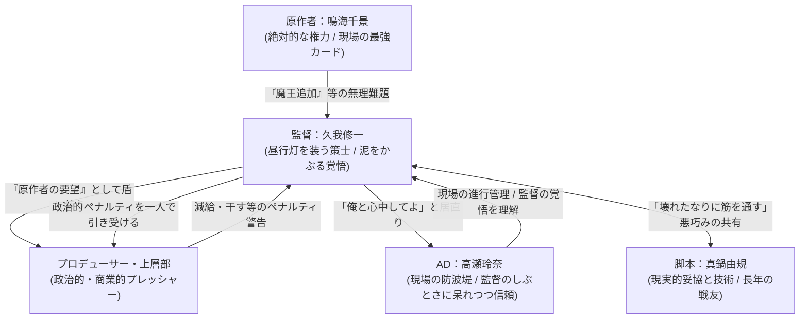

# 01 原作案: 人物深掘り_久我修一

## 1. はじめに（原作案の方向性・コンセプト）

本原作案は、作中映画『雨がやむまで、世界がもつなら』の監督である**久我修一（51）**を単なる「無能な商業監督」や「エゴイスティックで冷酷な怪物」として描くのではなく、**「普段は頼りない昼行灯（ひるあんどん）を装いつつ、裏では誰よりも鋭く現場をコントロールし、泥をかぶって部下（キャスト・スタッフ）を守るしぶといおっさん監督」**として再設計します。

彼は商業的制約や度重なるトラブル、原作者の無茶振りに振り回されているように見せかけながら、その実、誰よりも「現場のクリエイティブ」と「スタッフやキャストの尊厳」を守るためにゲリラ的な闘いを続けています。自ら悪役を引き受け、政治的ペナルティを一身に背負いながら、壊れかけた映画の中に「本物の奇跡」を宿らせようとする、泥臭くもしぶといプロフェッショナリズムを描写します。

---

## 2. 基本プロフィール

- **本名**: 久我 修一（くが しゅういち）
- **年齢**: 51歳（1975年生まれ）
- **職業**: 映画監督（フリーランス）
- **経歴**:
  - 大学の映画サークルで8mmフィルムを回し始め、卒業後は十数年にわたり助監督として現場の下積みを経験。深夜のロケハン、理不尽なプロデューサーからの叱責、低予算現場のデスマーチを生き抜いてきた「泥臭い現場叩き上げ」の遅咲き。
  - 30代後半でようやく監督デビュー。いくつかの低予算原作もの（コミック実写化やアイドル映画）を便利屋としてこなす。
- **代表作**:
  - 『たゆたう熱、あるいは沈黙』（2015年公開）
    - 単館系の静かな恋愛映画。自然光を活かした叙情的な画作りと、登場人物たちの「セリフのない沈黙の機微」が高く評価され、一部の批評家から絶賛された。しかし、興行収入は目標に届かず、商業的な大ヒットにはならなかった。久我にとっての「幸福な作家性の証明」であり、同時に「商業的限界」を突きつけられた傷でもある。
- **失敗作**:
  - 『アーク・オデッセイ』（2021年公開）
    - 製作委員会の意向で大抜擢された中規模SFファンタジー映画。出資会社ごとのタイアップねじ込みや、脚本の度重なる変更要求、過酷なCG制作スケジュールにより現場のコントロールを完全に喪失。自身の作家性を剥ぎ取られた挙句、支離滅裂な作品となり、興行的にも大惨敗。「終わった監督」「制御力のない現場管理者」という烙印を押され、数年間のスランプと業界での冷遇を経験した。この時の手痛い挫折が、現在の「昼行灯を装って泥をかぶる」というゲリラ的スタイルを生む契機となった。

---

## 3. なぜ「恋愛映画」にこだわるのか（撮ろうとした理由）

久我にとって「恋愛映画」とは、単なるジャンルの嗜好ではなく、**「他者という、究極に思い通りにならない存在」**と対峙するための唯一のフレームワークです。

### ① 創作者としての消えない「業」と呪い
久我には若い頃、約8年間同棲し、結婚も考えていた女性（元パートナー・有村奈緒）がいました。ある夜、追い詰められた彼女が手首を切る真似をして泣き叫んだ際、久我が必死で救急車を呼びながらも、脳裏のどこかで「タイルの血痕の逆光反射」や「指先の震えのテンポ」を冷徹に観察し、記録してしまった過去があります。
これは彼が冷酷なサイコパスだからではなく、極限状態にあってもカメラマン・演出家としての目をオフにできないという「創作者としての消えない業」でした。久我は誰よりもその業の醜悪さにゾッとし、自己嫌悪の呪いとしてその傷を抱え続けています。
彼が恋愛映画に執着するのは、かつて現実でその「業」によって壊してしまった他者との関係を、虚構のフレーム（カメラと演出）の中で「今度こそ完璧に支配し、美しい結晶として保存したい」という、極めて個人的でエゴイスティックな贖罪の欲求に基づいています。

### ② 本作『雨がやむまで、世界がもつなら』への初期衝動
本作の初期プロット（美咲が雨の駅前で届かない手紙を抱えて悠人を待つ純愛劇）は、久我にとって「かつて自分が手を離してしまった関係の、最も美しい形の再構築」になるはずでした。彼は、この映画を完成させることで、かつての奈緒への呪いを精算し、監督として復活するつもりでした。

---

## 4. 映像表現のこだわりと特長

久我は「映画とは、言葉ではなく『写ってしまったもの』で語るべきだ」という強い美学を持っています。

- **「沈黙の10秒間」への偏執**:
  台詞の応酬ではなく、台詞が途切れた瞬間の「間」を執拗に切り取ります。役者が次に発する言葉を探して喉を動かす瞬間、視線を逸らすコンマ数秒、手のひらの中でくしゃりと握られる封筒の摩擦音。そこにこそ「本物の感情」が宿ると信じています。
- **エモーショナルな「実在感」のある画作り**:
  人工的なフラットな照明を嫌い、雨粒が反射するアスファルトの鈍い光や、コンビニの自動ドアから漏れる頼りない蛍光灯の白さ、夕暮れ時の逆光など、泥臭くも情緒的な光を好みます。
- **「雨」の演出への狂気**:
  雨をただの記号として降らせることを嫌います。アスファルトの濡れ具合（照り返しが役者のアゴを照らす角度）や、ビニール傘の骨を伝う雨粒の速度にこだわり、特機（散水車）の調整で何度もスタッフを走らせます。

---

## 5. 制作スタッフ陣との関係性・力関係

映画のジャンルが「恋愛」から「異世界ファンタジー」「魔王召喚」へと壊れていく中で、久我は頼りない昼行灯を装いつつ、狡猾に現場の自由度を死守しています。

### ① 原作者：鳴海千景との力関係
表向きは、原作者である鳴海の度重なる無理難題（「コンビニ魔王」「馬車が渋滞」など）に胃を痛めて振り回される頼りない監督を装っています。しかし裏では、「原作者の先生がこう仰っているので従うしかない」とプロデューサーたちを丸め込むための「強力な外交カード（交渉道具）」として彼女の存在をしぶとく利用しています。これにより、製作委員会や出資会社からの理不尽な口出しをシャットアウトし、結果的に現場のクリエイティブな自由度を死守する狡猾さを備えています。

### ② 脚本：真鍋由規との関係
真鍋は同世代で、下積み時代からの戦友です。久我の美意識を最も理解している一方で、真鍋は「破綻した原作でも、お金が動いている以上はエンタメとして成立させるのがプロの仕事」と割り切っています。
久我が「こんなの俺の撮りたい恋愛映画じゃない」と愚痴るたびに、真鍋は「じゃあどうする？ 撮影止めるか？ 壊れたまま、誰も見たことのない強引な筋を通すのが、今の俺たちの戦い方だろ」と冷たく、しかし並走する相棒として引き留めます。

### ③ AD：高瀬玲奈との関係
進行管理を一手に担う高瀬を深く信頼していますが、散水制限（残り5分）といった過酷な状況下でも「俺と心中してよ」とトボけた軽口を叩いて居直り、意図的に撮影を押させることがあります。これは単なる芸術的エゴや自己保身ではなく、「ここで妥協したら、この現場の全員がただの量産型映画の歯車として消費されて終わる」という現場のクリエイティブとスタッフたちの尊厳を守るための選択です。
当然、時間押しによるプロデューサーや上層部からの政治的ペナルティ（減給や業界で干されるリスク）は、すべて久我自身が泥をかぶって引き受ける覚悟を持っています。高瀬は彼のその「しぶとい盾としての姿勢」を呆れつつも理解しており、裏で彼を支える強力な防波堤となっています。

---

## 6. キャスト陣へのまなざしと、山野光抜擢の「真の意図」

久我はキャストたちの心象や弱みを深く洞察しており、彼らから最高の演技を引き出すためにあえて過酷な役割を演じます。

### ① 佐伯 蓮（悠人役）への評価と不器用な親心
久我は、佐伯がこれまで多くのオーディションに落選し、この映画を最後に引退しようとしていることを見抜いています。本番前に佐伯の過去の落選履歴や痛いところを囁くような過酷な演出は、単なる冷酷な感情搾取ではなく、「役者として最後の瞬間になるかもしれない彼に、生涯最高の輝きを残してやりたい」という、不器用で深い親心に基づいています。
あえて自ら悪役（嫌われ役）を買って出ることで、佐伯の胸の奥にある生の焦燥と激情を引き出し、それによって佐伯から向けられる怨みや憎まれ口はすべて自分が背負うという強固な覚悟を持っています。

### ② 朝倉 澪（美咲役）への評価
朝倉の演技力を天才的だと絶賛し、信頼しています。しかし、彼女が「プロとして傷つかないように、完璧に計算された芝居」をすることに対して、物足りなさも感じています。
久我は、朝倉の「良い子であろうとする防壁」が剥がれ、彼女自身が抱える生々しい孤独や醜さがカメラの前に露出する瞬間（＝コントロールから外れた生のエモーション）を、狙っています。

### ③ 山野 光（魔王役）を抜擢した本当の演出意図と感情
エキストラにすぎなかった山野光を「魔王」に大抜擢した背景には、久我の**「執念と自暴自棄が混ざり合ったエゴ」**があります。

- **建前の理由（カメラテストでの発見）**:
  カメラテストの際、ファインダー越しに見た山野の「画面を支配する圧倒的な異物感」に気づいたため。彼がただぼんやりと立っているだけで、チープな異世界設定が「本物の異常事態」としてのリアリティを帯びる、という直感。
- **本音の意図（自己破壊とテロル）**:
  鳴海の無茶振りで自分の美しい恋愛映画が崩壊していくことへの、久我の**「自虐的なテロ行為」**です。「どうせ壊されるなら、一番わけのわからない素人を真ん中に据えて、この映画を徹底的にカオスにしてやる」という、商業映画のシステムに対するささやかな復讐心と、制御を失うことへの自暴自棄な快楽。
  また、佐伯や朝倉といった「プロとして小さくまとまろうとする役者たち」の前に、一切の芝居のセオリーが通じない「本物の素人（異物）」を投げ込むことで、彼らの演技の予定調和を破壊し、生々しい反応を引き出したいという演出上の罠（テロル）でもありました。
- **抜擢時の感情の揺らぎ**:
  山野を抜擢し、カメラを回した瞬間、久我は「恐怖」を覚えました。自分が支配・コントロールできる領域の外側から、映画のすべての意味を塗り替えてしまうような「本物の何か」が写ってしまったからです。それは、かつて『アーク・オデッセイ』で感じた「制御不能の恐怖」であると同時に、「自分の想定を超えた、奇跡のような瞬間」が映画に宿る歓喜でもありました。

---

## 7. コントロール喪失への焦りと、プロとしての執念・弱さ

映画が自分の手を離れ、異世界転換や役者の生々しい感情に侵食されていく中で、久我は激しく葛藤します。

- **昼行灯の仮面と、裏のコントロール**:
  普段は「まいったなぁ、プロデューサーがうるさくてさ」「原作者の先生の言う通りにするしかないよね」と頼りない昼行灯を装い、無害な存在に見せています。しかしその裏では、現場の各スタッフやキャストの心理を誰よりも鋭く見抜き、彼らが最高のパフォーマンスを発揮できるように裏から巧妙にコントロールしています。
- **プロとしての執念と心中（しぶといおっさん監督）**:
  「映画の歯車になるな。たとえ壊れかけの映画でも、俺たちがここで放つ一瞬の光だけは本物でなきゃいけない」
  上層部からどれほど脅されようが、現場のクリエイティブを殺すような妥協は決して許しません。政治的なペナルティは全て自分が背負い、部下たちの防波堤（盾）となって泥をかぶる。そのしぶとさこそが、彼のプロフェッショナリズムです。
- **クリエイターとしての業と呪い**:
  極限状態にあってもカメラマンの目をオフにできない「創作者としての消えない業」と、それに伴う深い自己嫌悪。この業から逃れられないからこそ、彼は自らの人生すべてを映画に捧げ、泥をかぶることを厭わないのです。

---

## 8. 人生年表

| 年齢 | 出来事 | 本人への影響 | 作品（現場）で使える形 |
| :--- | :--- | :--- | :--- |
| **0歳** | 1975年：東京都で生まれる。 | 特になし。 | - |
| **18歳** | 大学の映画サークルに入る。 | 映画の魔力に取り憑かれ、8mmフィルムで自主制作を開始。 | 映画は「自分が望む世界を全てコントロールできる箱庭」だと信じていた頃の無邪気さ。 |
| **23歳** | 卒業後、フリーランスの助監督として業界に入る。 | 現場の過酷さに揉まれ、自分の「表現」ではなく「スケジュールと予算」に追われる日々が始まる。 | 現場の実務や、AD高瀬の苦労を実は誰よりも身に沁みて分かっている根底の視点。 |
| **32歳** | 同棲していたパートナー・有村奈緒と破局。 | 奈緒が手首を切る真似をした夜、必死で救急車を呼びながらも「タイルの血痕の逆光反射」や「指先の震えのテンポ」を無意識に観察・記録してしまった過去。 | 創作者としての消えない「業」に対する深い自己嫌悪と呪い。この経験が彼の「恋愛映画」への執着と、映画に命を懸ける狂気の土台となる。 |
| **40歳** | 初の商業長編『たゆたう熱、あるいは沈黙』を監督。 | 映像美と沈黙の演出が批評家に絶賛されるが、商業的にはヒットせず。「作家性」と「興行」のジレンマを抱える。 | 彼の演出のシグネチャー（沈黙、光, 雨）の確立。自身のプライドの拠り所。 |
| **46歳** | 大作SF『アーク・オデッセイ』で大爆死。 | 製作委員会に振り回され、現場の制御を完全に失う。大声で吠えるアーティストとしての限界を知る。 | 制御不能な状況に対するトラウマと、その反省から生まれた「ヘラヘラした昼行灯」の仮面。 |
| **51歳** | 本作『雨がやむまで、世界がもつなら』の監督に就任。 | かつてのパートナーとの関係の精算をかけた純愛映画を目指すが、原作者・鳴海の改変で現場が混乱。 | 現在の立ち位置。昼行灯を装いながら、政治的リスクを引き受けて現場を守るしぶといおっさん監督。 |

---

## 9. 象徴的エピソード

### エピソード1: 「昼行灯」の誕生と泥をかぶる決意（過去の挫折と転換点）
- **時期**: 5年前（『アーク・オデッセイ』撮影終盤）
- **出来事**:
  スポンサーの意向による「強引な変更要求」に対して、久我はかつてのように激昂してモニターを蹴り倒し、スタッフの前で声を荒らげた。しかし、その結果生じたしわ寄せはすべて現場の末端スタッフ（高瀬など）の深夜残業や理不尽な叱責として跳ね返り、結果として作品も最悪の形で妥協させられた。
  この手痛い失敗を経て、久我は「大声で吠えるアーティスト」であるのをやめた。自分が頼りない昼行灯を演じて上層部を油断させ、裏で鳴海のような原作者の威光をカードとして使いながら、最終的なペナルティは全て自分が一人で引き受けて現場を守るという、現在の「しぶといゲリラ戦法」を身につけた。
- **その人らしさ**:
  かつての子供じみたプライドを捨て、現場のクリエイティブとスタッフを守るために「泥をかぶる防波堤」となることを選んだ、彼の大人のプロフェッショナリズムとしぶとさ。
- **作品での使い道**:
  高瀬が、かつて荒れていた久我を知っているからこそ、現在の「ヘラヘラした昼行灯」の裏にある彼の覚悟と不器用な優しさを誰よりも理解しているという関係性の裏付けとして描く。

### エピソード2: 山野光の「15秒の沈黙」（今回の撮影現場）
- **時期**: 今回の撮影中（魔王役・山野光の初テスト撮影）
- **出来事**:
  エキストラから抜擢された山野は、段取りも台詞も忘れ、降ってくる雨をただ見上げて立ち尽くした。スタッフ全員が「NG、カット」だと思い、助監督がメガホンを上げようとした瞬間、久我は「……回せ、そのまま回し続けろ」とスタッフを制止した。山野がただ雨に濡れ、無自覚に佇むその15秒間の「沈黙」をカメラが捉えた時、ファインダー越しに、チープな魔王の衣装が本物の「世界の異物」として立ち上がる瞬間を、久我は目撃した。
- **その人らしさ**:
  自分の意図やコントロールを完璧に超えた「偶然の奇跡」に対して、監督として平伏し、それを利用しようとする、プロとしての執念と敗北感の混在。
- **作品での使い道**:
  久我が山野の中に「映画の新しい意味」を見出し、自分の映画がコントロールを失いながらも「本物」へ化けていく予感に震える、物語の中盤の決定的な転換点として描写する。

---

## 10. 小説執筆に向けた「場面目的」と「感情変化」の設計例（3,000字以内想定）

脚本家やライターが実際に執筆しやすくなるよう、久我の視点を中心にしたシーン構成案を提示します。

### シーン案: 山野光のカメラテストと久我の葛藤
- **場面目的**:
  崩壊していく映画への焦りの中で、久我が「異物」である山野光のカメラテストを行い、制御不能の恐怖と、それを超える「映画の奇跡」をファインダー越しに発見する。
- **出来事**:
  1. 鳴海からの無茶振り（魔王登場）に対して、ヘラヘラと「いやぁ、原作者の先生がこう言ってるからね。プロデューサーにもそう説明しておいてよ」と交渉材料にしつつ、裏ではこの「壊れかけの映画」に決定的な本物を宿らせるための仕掛け（山野の抜擢）を静かに進める久我。
  2. 高瀬が手配したエキストラ登録の山野光が、間に合わせの衣装を着て雨の駅前セットに立つ。
  3. 山野は芝居の段取りがわからず、台詞を忘れて立ち尽くす。現場に白けた空気が流れ、カットをかけようとするスタッフ。
  4. 久我はファインダーを覗き、山野の瞳に宿る「圧倒的な実在感」に気づき、カメラを止めさせない。
  5. 15秒の沈黙の後、山野がふと「俺でよければ……」と呟く瞬間、久我の中で映画の「新しい意味」が立ち上がる。
- **感情変化**:
  - 【開始】: 昼行灯のヘラヘラした余裕（裏で上層部やプロデューサーの政治的圧力をいなす狡猾さ）と、その奥にある「絶対にこの現場を歯車として消費させない」というしぶとい闘志。
  - 【中盤】: 観察と見極め（山野という異物がカメラの前で放つ実在感を、プロフェッショナルなカメラマン・演出家としての「業」の目で鋭く捉える）。
  - 【結末】: 静かな覚悟（山野の「15秒の沈黙」から映画の真髄を引き出し、プロデューサーからの減給や干されるリスクをすべて背負って「俺と心中してよ」と高瀬に居直る不敵な笑み）。
- **伏線回収の仕込み**:
  - 駅前の時計が「午後六時を少し過ぎたところ」で止まっている画を、久我がどのタイミングでどうフレーミングするか。山野の静止と、止まった時計が「時間が混線した世界の説得力」として重なる瞬間をカメラに収める。
